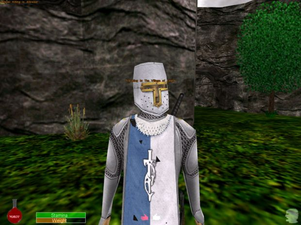
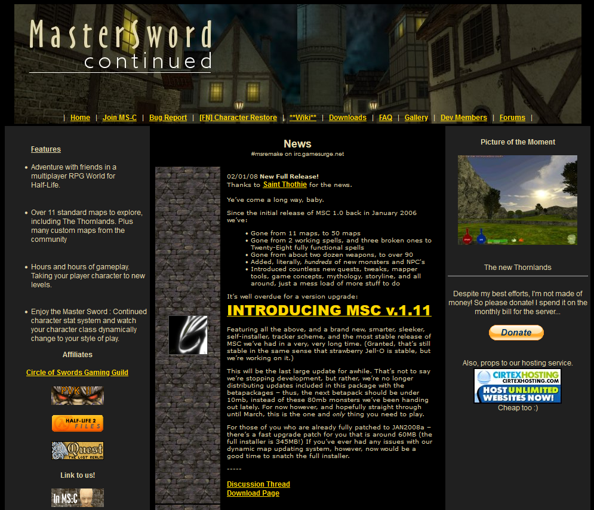

# Master Sword: Rebirth Overview

Welcome to the in-game section of the documentation! This page should give you an overview of the game. Here you can find articles about all of the items, NPCs, and maps in the game.

## F.A.Q.

### What IS Master Sword, Master Sword Continued, and Master Sword Rebirth?

???+ info "Click or tap to Open/Close"
    Master Sword started out as a simple first person role playing total conversion mod for Half Life released in the late 1990s. It sported few maps and very limited game functionality. Yet, it set a solid precedence for what was to come and what was possible with the engine. Its ambitions were high but were limited by the technology of its time. Master Sword: Continued, simply put, was a continuation of that project with a different set of developers and a wider reaching community, releasing in the mid-to-late 2000s. The scope of the maps got wider, more items introduced, and more mechanics implemented. With time, however, the game became more unstable and as the community contributors aged, so did the mod. Eventually, development officially ceased in the mid 2010s. The source code for the game was released for whomsoever to pick up the torch and continue onward.
    
    

    That’s what leads us here; to Master Sword: Rebirth. Think of it as “Master Sword: Continued: Continued” where the scope of the game has widened, more features introduced, and a much, much more stable gaming experience all working on the same game engine that started this entire project over 20 years ago. Having started up in the early 2020s, Master Sword: Rebirth seeks to recapture that old school gaming magic that has seemingly been lost to time. The modification focuses on an "MMO-lite" design with persistent characters across an in-game network called "FuzzNet" or "FN" which will save your characters' progress between servers that are FN enabled.

### What happened to MS:C, MS:S, and the msremake.com forums?

??? info "Click or tap to Open/Close"
    Throughout Master Sword: Continued’s development, many teams have branched off to create their own versions on different engines. Be it the Source engine, Unity, or even Unreal; everyone involved realizes that Master Sword has a certain charm to it and wished to see it furthered technologically alongside other games. Unfortunately, as these are all labors of love, none else have come to fruition. 

    

    Due to increasing hosting costs of the msremake.com website and subsequent forums, a third party host was utilized to keep both the game servers and the websites up and running. Eventually, so too the host would disappear to time. With it, the websites and game servers would lapse with no way to bring them back online.

### Why the change to Rebirth, and what all is changing?

??? info "Click or tap to Open/Close"
    Master Sword: Continued is very buggy and unstable. The move to Rebirth will allow for a much better end user experience as the performance is vastly improved, stability is almost perfect, and the game as a whole feels far more refined. The ultimate goal is to get a store page on Steam to allow for easy patch distribution and communication with the community. Think of it akin to Sven Co-Op being listed as a mod on Steam.