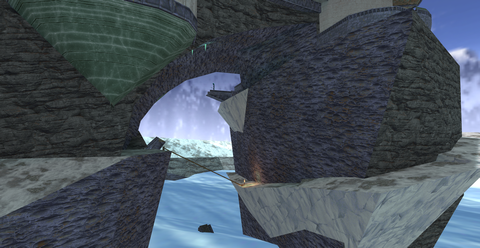

# Example article with an image.

{ align=right }
Each "section" of the wiki needs its own assets folder, IDK how to navigate up the file structure while loading images here.

A typical in-game wiki article would probably contain an image aligned like this one, followed by a lot of text and explanations that tell you everything you need to know about the topic you are viewing. Words.

You can also align things to the left!
{ align=left }